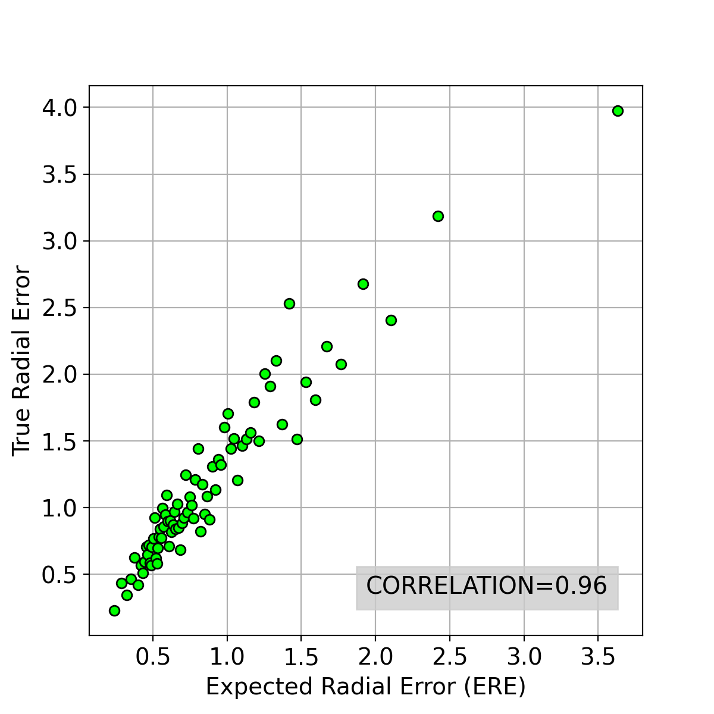
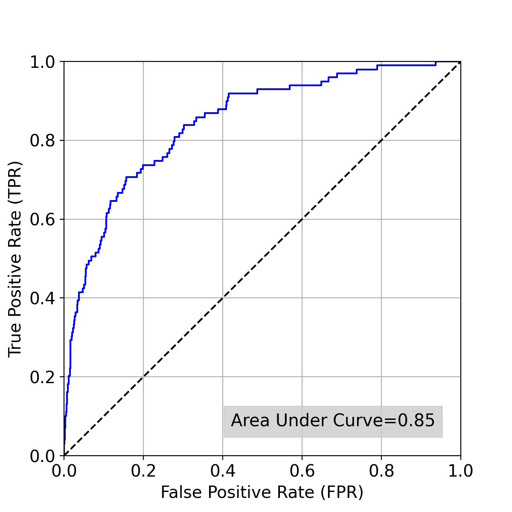
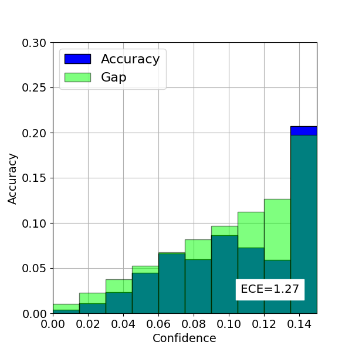

# Contour Hugging Heatmaps

## Requirements

## Quick start

### Install

1. Go to your chosen directory , clone this repo then enter it:
```
git clone https://github.com/jfm15/ContourHuggingHeatmaps.git
cd ContourHuggingHeatmaps/
```

2. Install required packages. In this guide we create our own virtual environment:

```
python3 -m venv {virtual_environment_name}
source {virtual_environment_name}/bin/activate
pip install --upgrade pip
pip install -r requirements.txt
```

### Dataset Preparation

1. Download the cephalometric dataset from the link: http://www-o.ntust.edu.tw/~cweiwang/ISBI2015/challenge1/

2. Extract the folders 'RawImage' and 'AnnotationsByMD' into a directory of your choosing such that the file structure looks like this:

````bash
{cephalometric_data_directory}
├── AnnotationsByMD
│   ├── 400_junior
│   │   ├── 001.txt
│   │   ├── 002.txt
│   │   ├── ...
│   │   └── 400.txt
│   │
│   └── 400_senior
│   │   ├── 001.txt
│   │   ├── 002.txt
│   │   ├── ...
│   │   └── 400.txt
│   │
└── RawImage
    ├── TrainingData
    │   ├── 001.bmp
    │   ├── 002.bmp
    │   ├── ...
    │   └── 150.bmp
    │
    └── Test1Data
    │   ├── 151.bmp
    │   ├── 152.bmp
    │   ├── ...
    │   └── 300.bmp
    │
    └── Test2Data
        ├── 301.bmp
        ├── 302.bmp
        ├── ...
        └── 400.bmp
````

If you publish work using this dataset you must cite:
````
@article{wang2016benchmark,
  title={A benchmark for comparison of dental radiography analysis algorithms},
  author={Wang, Ching-Wei and Huang, Cheng-Ta and Lee, Jia-Hong and Li, Chung-Hsing and Chang, Sheng-Wei and Siao, Ming-Jhih and Lai, Tat-Ming and Ibragimov, Bulat and Vrtovec, Toma{\v{z}} and Ronneberger, Olaf and others},
  journal={Medical image analysis},
  volume={31},
  pages={63--76},
  year={2016},
  publisher={Elsevier}
}
````

### Running The Code

You can either train the model yourself or download one of our pretrained models.

#### 1. Train a model

1.1 Train a model using the following command. This script resizes images in your training set directory 
and saves them in ContourHuggingHeatmaps/cache. After 15 epochs it will save the model at
ContourHuggingHeatmaps/output/cephalometric/cephalometric_model.pth.

```
python train.py --cfg experiments/cephalometric.yaml --training_images {cephalometric_data_directory}/RawImage/TrainingData/ \
 --annotations {cephalometric_data_directory}/AnnotationsByMD/
```

1.2 Performing temperature scaling on the model saved in the previous step using the following command. 
The model with the best Estimated Calibration Error (ECE) score will be saved at ContourHuggingHeatmaps/output/cephalometric/cephalometric_scaled_model.pth.

```
python temperature_scaling.py --cfg experiments/cephalometric.yaml --fine_tuning_images {cephalometric_data_directory}/RawImage/Test1Data/ \
 --annotations {cephalometric_data_directory}/AnnotationsByMD/ --pretrained_model output/cephalometric/cephalometric_model.pth
```

#### 2. Download a model

2.1 If you would like you can download our pretrained models at the following link: https://app.box.com/s/4qz3tthh7q6xajtaasj4fp9iaw86mmyx

#### 3. Testing

3.1 Test the models using the following commands where {model_path} is the path to the model you have trained or downloaded. 
You can either test the basic model trained or the temperature scaled model.

```
python test.py --cfg experiments/cephalometric.yaml --testing_images {cephalometric_data_directory}/RawImage/{Test1Data or Test2Data}/
--annotations {cephalometric_data_directory}/AnnotationsByMD  --pretrained_model {model_path}
```

This script will output Mean Radial Error (MRE) and Successful Detection Rate (SDR) statistics. In addition, it will 
save the following graphs (with slightly different numbers because training a model is a non-deterministic process) in 
ContourHuggingHeatmaps/output/cephalometric/. Please refer to our paper for a detailed explanation of these.

#### The Expected Radial Error vs True Radial Error plot



#### Receiver operating characteristic curve



#### Reliability diagram

